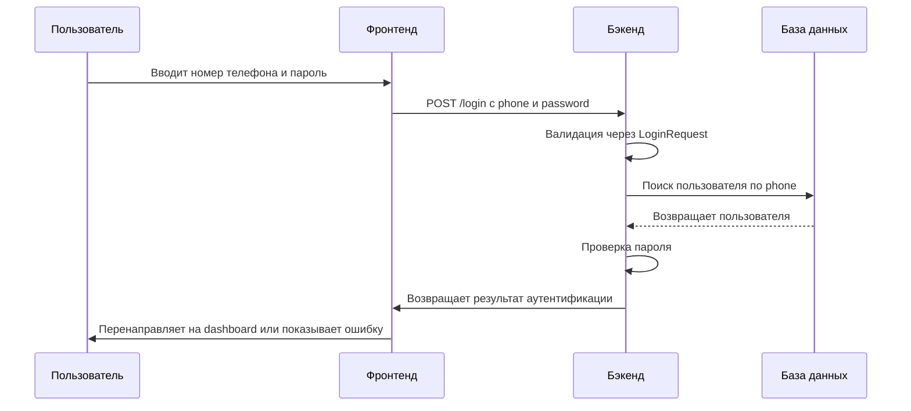
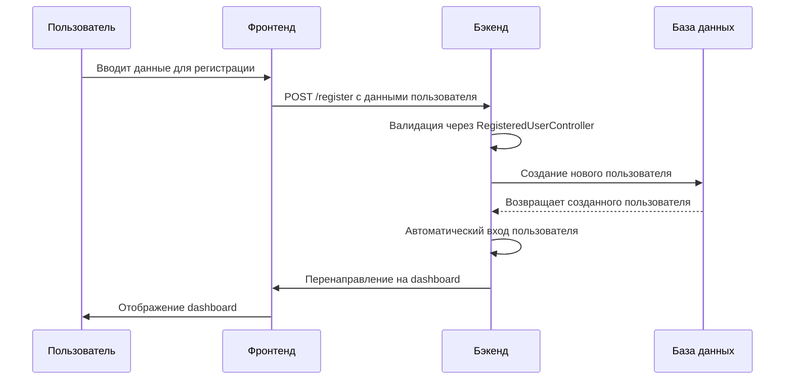
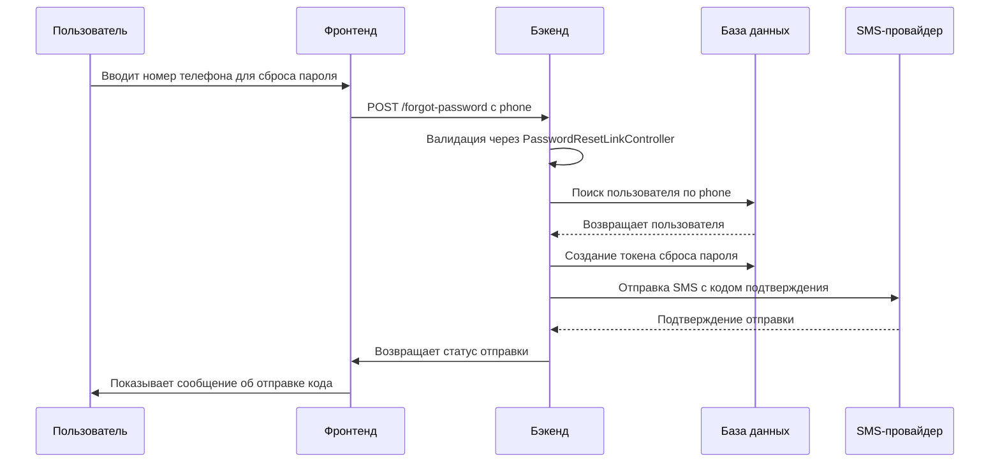

# Архитектура системы аутентификации по номеру телефона

## Общая архитектура

```mermaid
graph TD
    A[Пользователь] --> B[Фронтенд (Vue.js)]
    B --> C[API (Laravel)]
    C --> D[База данных (MySQL)]
    C --> E[SMS-провайдер]
    
    subgraph "Фронтенд"
        B1[Login.vue]
        B2[Register.vue]
        B3[ForgotPassword.vue]
    end
    
    subgraph "Бэкенд"
        C1[LoginRequest]
        C2[AuthenticatedSessionController]
        C3[RegisteredUserController]
        C4[PasswordResetLinkController]
        C5[User Model]
    end
    
    subgraph "База данных"
        D1[users table]
        D2[password_reset_tokens table]
    end
    
    subgraph "Внешние сервисы"
        E1[SMS-провайдер]
    end
    
    B --> B1
    B --> B2
    B --> B3
    
    B1 --> C1
    B2 --> C3
    B3 --> C4
    
    C1 --> C2
    C2 --> C5
    C3 --> C5
    C4 --> C5
    
    C5 --> D1
    C4 --> D2
    
    C4 --> E1
```

## Поток аутентификации



## Поток регистрации



## Поток сброса пароля



## Компоненты системы

### 1. Модель пользователя (User Model)
- Хранит информацию о пользователе
- Поддерживает аутентификацию по номеру телефона
- Содержит поля: first_name, last_name, middle_name, phone, email, password

### 2. Запрос на вход (LoginRequest)
- Валидирует данные для входа
- Извлекает 10 цифр из номера телефона
- Поддерживает аутентификацию по телефону

### 3. Контроллер аутентификации (AuthenticatedSessionController)
- Обрабатывает запросы на вход и выход
- Управляет сессией пользователя

### 4. Контроллер регистрации (RegisteredUserController)
- Обрабатывает регистрацию новых пользователей
- Создает пользователя с номером телефона

### 5. Контроллер сброса пароля (PasswordResetLinkController)
- Обрабатывает запросы на сброс пароля
- Отправляет код подтверждения через SMS

### 6. Фронтенд компоненты
- Login.vue - форма входа
- Register.vue - форма регистрации
- ForgotPassword.vue - форма сброса пароля

### 7. База данных
- Таблица users - хранит информацию о пользователях
- Таблица password_reset_tokens - хранит токены сброса пароля

## Безопасность

### Валидация номера телефона
- Извлечение 10 цифр из любого формата
- Проверка на корректность номера
- Защита от инъекций и XSS

### Защита от брутфорса
- Ограничение количества попыток входа
- Блокировка по IP адресу при превышении лимита
- Логирование всех попыток входа

### Шифрование данных
- Пароли хранятся в хэшированном виде
- HTTPS для всех запросов
- Защита от перехвата данных