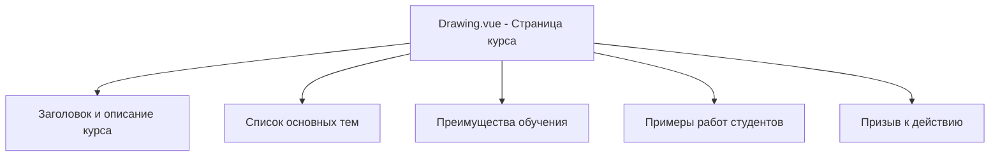
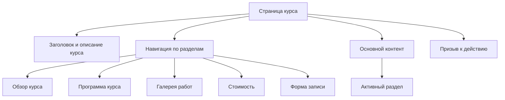
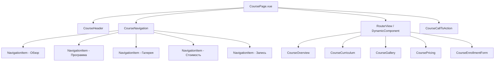

# Архитектура страницы курса с несколькими разделами

## Текущая структура страницы курса (Drawing.vue)



## Предлагаемая архитектура с дополнительными разделами



## Подробная структура компонентов



## Альтернативный подход: Одна страница с разделами

```mermaid
graph TD
    A[CoursePage.vue] --> B[CourseHeader]
    A --> C[SectionTabs]
    A --> D[SectionContent]
    A --> E[CourseCallToAction]
    
    C --> C1[Tab - Обзор]
    C --> C2[Tab - Программа]
    C --> C3[Tab - Галерея]
    C --> C4[Tab - Стоимость]
    C --> C5[Tab - Запись]
    
    D --> D1[OverviewSection]
    D --> D2[CurriculumSection]
    D --> D3[GallerySection]
    D --> D4[PricingSection]
    D --> D5[EnrollmentFormSection]