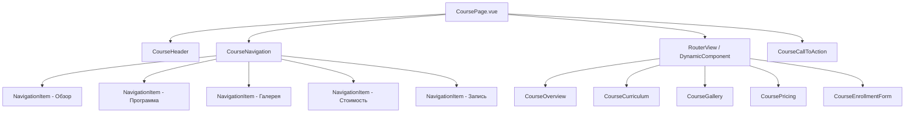

# План организации страниц курсов с несколькими разделами

## Обзор текущей ситуации

В проекте существует страница курса `Drawing.vue`, которая содержит следующие разделы:
- Заголовок и описание курса
- Список основных тем
- Преимущества обучения
- Примеры работ студентов
- Призыв к действию

Для расширения функциональности требуется добавить следующие разделы:
- Программа курса
- Галерея работ
- Стоимость
- Форма записи

## Архитектурное решение

### Структура компонентов



### Структура файлов

```
resources/js/
├── pages/
│   └── courses/
│       ├── [slug].vue          # Динамическая страница курса
│       └── components/
│           ├── CourseHeader.vue
│           ├── CourseNavigation.vue
│           ├── CourseOverview.vue
│           ├── CourseCurriculum.vue
│           ├── CourseGallery.vue
│           ├── CoursePricing.vue
│           ├── CourseEnrollmentForm.vue
│           └── CourseCallToAction.vue
└── components/
    └── courses/
        ├── CourseCard.vue
        └── CourseList.vue
```

## Навигация между разделами

Рекомендуется использовать вкладки в верхней части страницы для десктопа и аккордеон для мобильных устройств:

### Десктоп:
- Вкладки в верхней части страницы
- Активная вкладка выделяется визуально
- При переключении меняется только содержимое основной секции

### Мобильные устройства:
- Аккордеон или выпадающее меню
- Экономия вертикального пространства
- Плавная анимация переходов

## Структура данных

### Расширение модели Course

```php
protected $fillable = [
    'name',
    'image',
    'alt',
    'description',
    'price',
    'slug',
    'meta_title',
    'meta_description',
    'category',
    // Новые поля:
    'curriculum',
    'gallery_images',
    'pricing_options',
    'enrollment_form_config',
    'duration',
    'schedule',
    'requirements',
    'learning_outcomes',
];

protected $casts = [
    'price' => 'integer',
    'gallery_images' => 'array',
    'pricing_options' => 'array',
    'enrollment_form_config' => 'array',
    'schedule' => 'array',
    'requirements' => 'array',
    'learning_outcomes' => 'array',
];
```

## Подход к маршрутизации

Рекомендуется использовать гибридный подход:

1. **Основная страница курса** (`/courses/{slug}`) - содержит все основные разделы с навигацией без перезагрузки страницы.

2. **Отдельная страница записи** (`/courses/{slug}/enroll`) - для формы записи.

3. **Поддержка якорных ссылок**:
   - `/courses/drawing#curriculum`
   - `/courses/drawing#gallery`
   - `/courses/drawing#pricing`

## Рекомендации по реализации

### Этап 1: Подготовка данных
1. Расширить модель Course новыми полями
2. Создать миграции для добавления новых столбцов в таблицу courses
3. Обновить CourseController для работы с новыми полями

### Этап 2: Создание компонентов
1. Разработать компоненты для каждого раздела
2. Создать навигационный компонент
3. Реализовать основную страницу курса

### Этап 3: Маршрутизация
1. Настроить маршруты в web.php
2. Реализовать переходы между разделами
3. Добавить поддержку якорных ссылок

### Этап 4: Адаптивность
1. Адаптировать навигацию для мобильных устройств
2. Оптимизировать отображение галереи работ
3. Проверить работу формы записи на всех устройствах

## Заключение

Предложенная архитектура обеспечивает гибкость, масштабируемость и удобство использования страниц курсов. Она позволяет легко добавлять новые разделы в будущем и поддерживает как SPA-навигацию внутри страницы, так и традиционные переходы между отдельными страницами для специфичных функций.