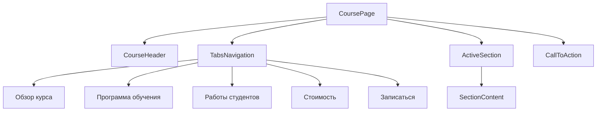
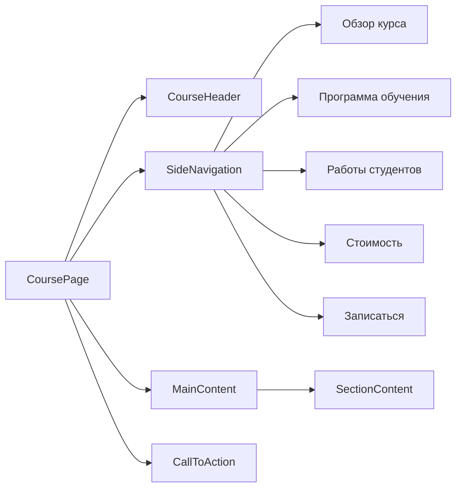
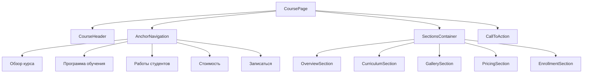

# План навигации между разделами курса

## Вариант 1: Вкладки в верхней части страницы

### Особенности реализации:
- Использование компонента Tabs из UI-библиотеки
- Активная вкладка выделяется визуально
- При переключении вкладок меняется только содержимое основной секции
- URL может изменяться при переключении вкладок (например, /courses/drawing#curriculum)

## Вариант 2: Боковое меню навигации

### Особенности реализации:
- Боковое меню фиксировано при прокрутке страницы
- Активный пункт меню выделяется
- Подходит для страниц с большим количеством контента

## Вариант 3: Якорная навигация на одной странице

### Особенности реализации:
- Все разделы на одной странице
- Навигация по якорям
- Плавная прокрутка к нужному разделу
- Активный пункт навигации подсвечивается при прокрутке страницы

## Рекомендации по выбору подхода

### Для мобильных устройств:
- Лучше использовать вкладки или аккордеоны для экономии вертикального пространства
- Боковое меню может быть скрыто за гамбургер-меню

### Для десктопа:
- Боковое меню обеспечивает лучшую навигацию при большом объеме контента
- Якорная навигация подходит для обзорных страниц

### Универсальный подход:
- Комбинировать несколько подходов в зависимости от размера экрана
- Использовать вкладки на мобильных устройствах и боковое меню на десктопе